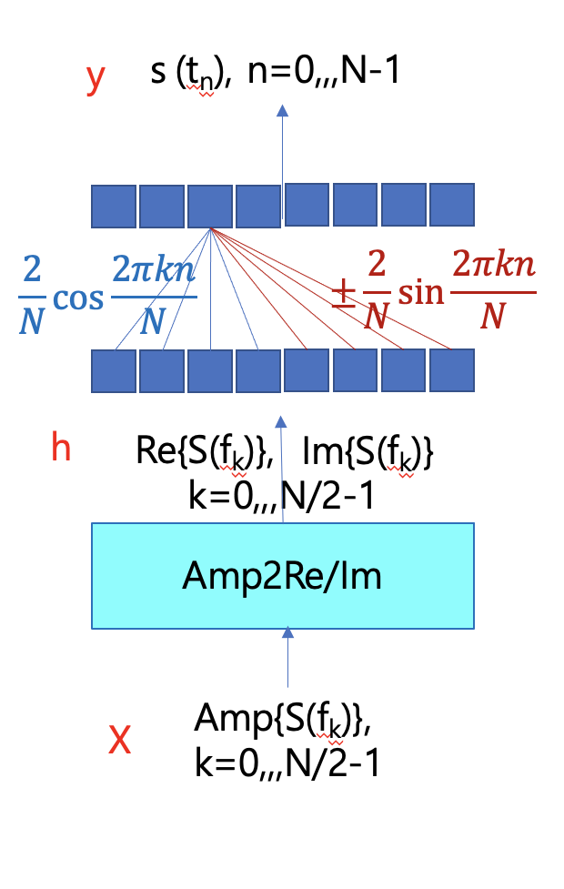

# Phase-Reconstruction-for-Amplitude-Spectrograms
Developing Vocoder for Text-to-Speech System

Language used : TensorFlow (Keras)
Dataset used : LJ Speech dataset, downloaded audio books

(on going project)

